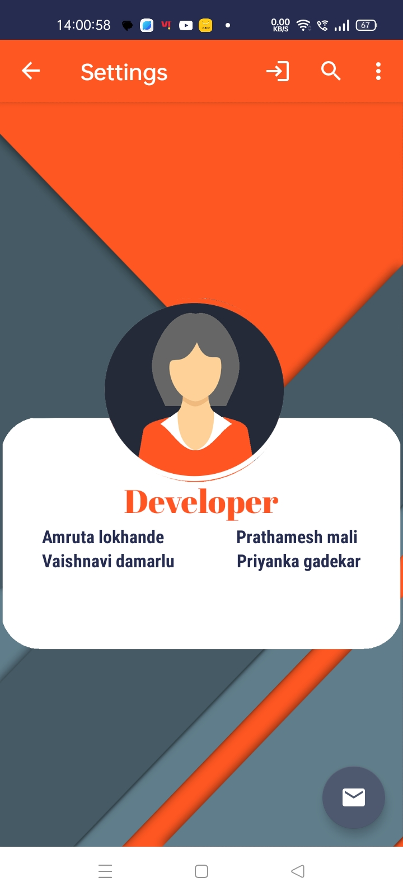
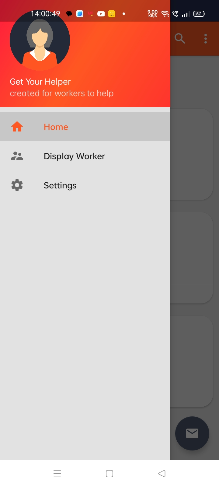
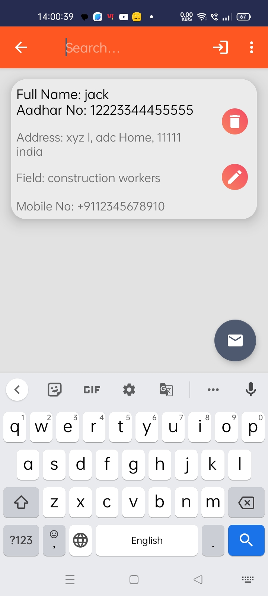
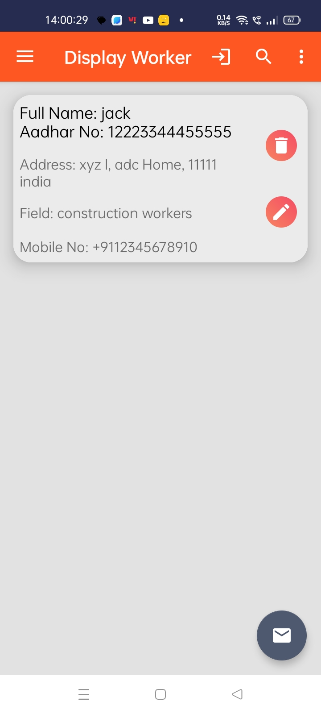
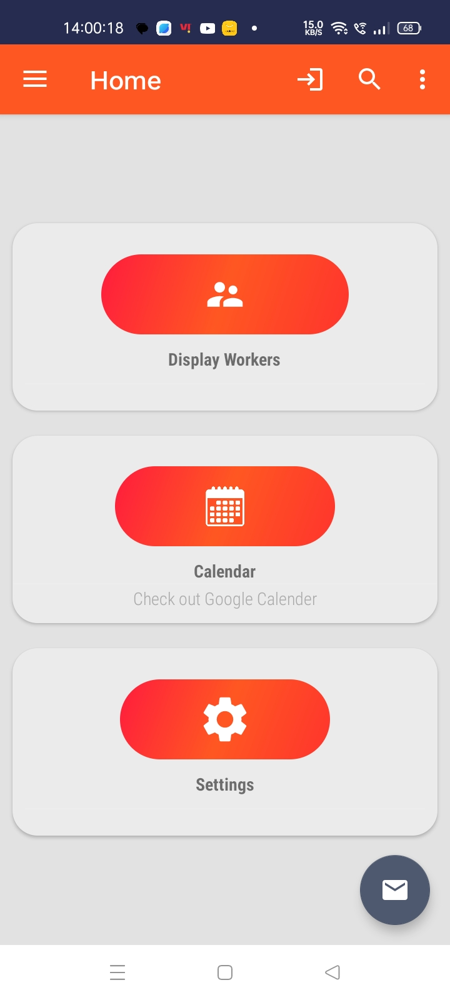
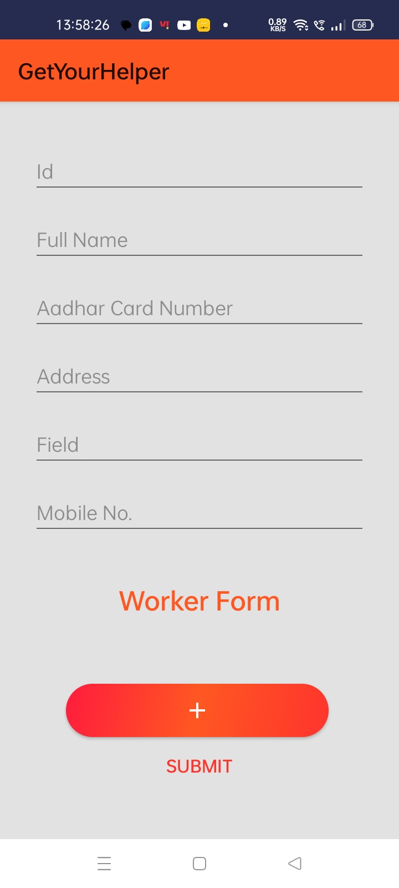
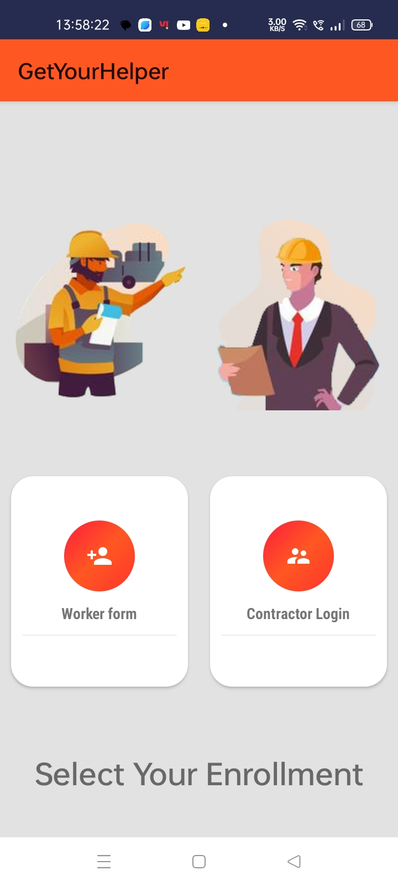

# GetYourHelper

A labor hiring management system is a software android solution  that simplifies the hiring process by automating recruitment and labor tasks such as job posting, application tracking, and onboarding. The system helps recruiters and hiring managers keep track of applicants and stages of the recruitment process, provide timely feedback, and manage communication.
## Documentation

[Documentation for android](https://developer.android.com/docs)

## Installation

Install on android studio

```bash
clone repo or download
import to android studio
and run...!

```
    
## Demo

here is a Demo apk


## Features

- worker form 
- HR login/signup
- dashboard
- edit/delete worker's form
- compos Email
- calendar 
- display worker

## Screenshots

<table>
<!--   <tr>
    <td>Welcome Page</td>
     <td>Login Page</td>
     <td>Sign Up Page</td>
     
  </tr> -->
  <tr>
    <td valign="top"></td>
    <td valign="top"></td>
    <td valign="top"></td>
  </tr>
<!--   <tr>
    <td>Personality Page</td>
    <td>Lifestyle Page</td>
    <td>Home Page</td>
  </tr> -->
  <tr>
    <td valign="top"></td>
    <td valign="top"></td>
    <td valign="top"></td>
  </tr>
<!--   <tr>
    <td>Finding Matches Page</td>
     <td>Chat Page</td>
  </tr> -->
  <tr>
    <td valign="top"></td>
    <td valign="top"></td>
  </tr>
 </table>


## Tech Stack

**android development:** Java, RxJava.

**db:** SQLITE

